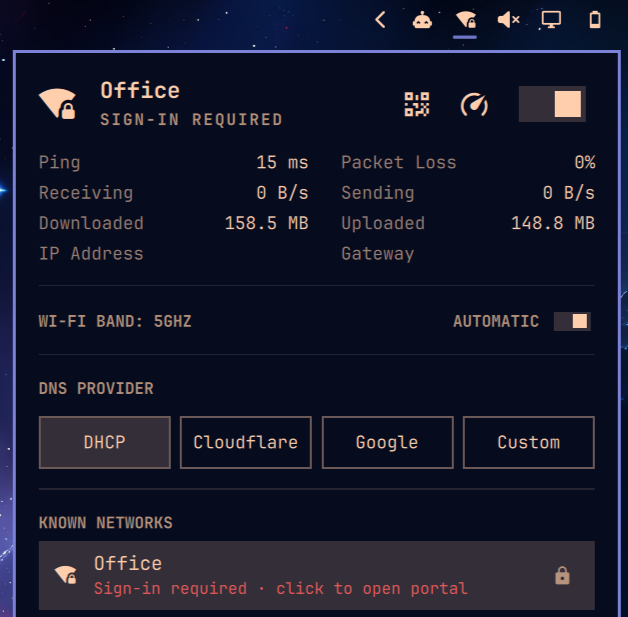
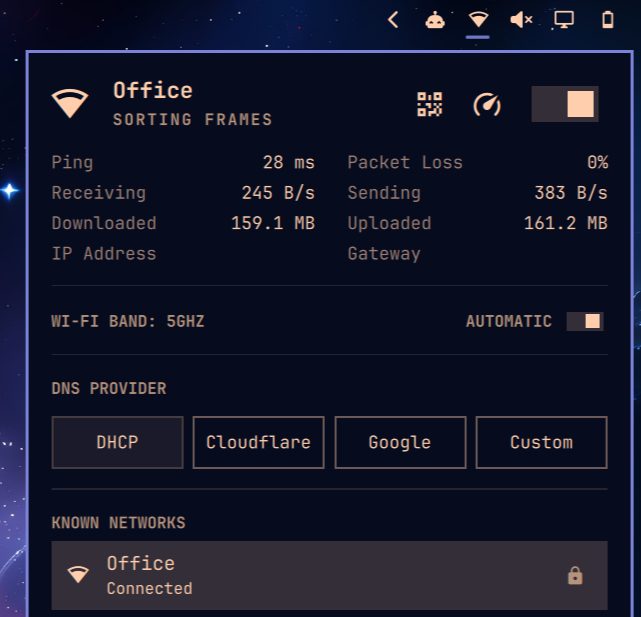

# Wi-Fi Portal

Network widget for the [Omarchy](https://omarchy.org) shell that tells you when a Wi-Fi network needs a sign-in page, and opens it — like your phone does.

| Behind a portal | Signed in |
|---|---|
|  |  |

## What it does

Behind a captive portal:

- the Wi-Fi icon in the bar becomes a **locked** Wi-Fi icon
- the network row in the panel turns red: **Sign-in required · click to open portal**
- click it → your browser opens the portal's login page

Signed in → everything goes back to normal.

Everything else the stock network widget does is still here.

## How it works

Right after you connect (and whenever you open the Wi-Fi panel), it fetches
`http://ping.archlinux.org` — the same URL NetworkManager already uses on Arch.

- page loads → you're online
- request gets redirected → a portal is in the way → lock icon + red row

Click the row → it opens wherever that redirect points, which is the portal's login page.

Nothing runs in the background.

## Install

```bash
omarchy plugin add https://github.com/remigius-labs/omarchy-wifi-portal.git --enable
```

Disable the built-in network widget so you don't have two:

```bash
omarchy plugin disable omarchy.network
```

## Remove

```bash
omarchy plugin remove remi.wifi-portal
omarchy plugin enable omarchy.network
```

## Credits

Derived from Omarchy's built-in `omarchy.network` plugin (MIT). No external
dependencies beyond the Omarchy shell (NetworkManager via Quickshell).
